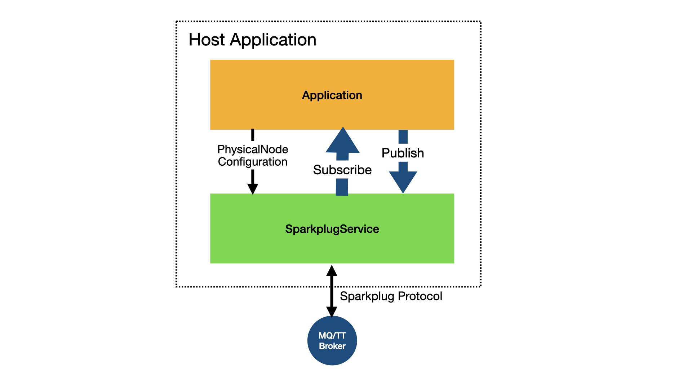

# Host Sparkplug Service

The `SparkplugService` is a Kotlin class that manages the connection to the MQ/TT broker and handles the Sparkplug Protocol

## SparkplugService

The service provides simple Kotlin-Flow based APIs that can be used by applications to publish and subscribe to metrics, and to observe node state.

The service will connect to specific physical noides on command from the application.




The service has the following constructor:

```kotlin
class SparkplugService(private val uri: String,
                       private val groupId: String,
                       private val hostAppId: String)
```

Where

- uri - it the url of the  MQ/TT broker
- groupId - is the identity of group that this host application belongs to
- hostAppId - is the host application-id

This will not do anything until it is given information about the node(s) it is to connect to.

## Subscribing to Nodes

To access a specific node and its metrics, the application must tell the `SparkplugService` to subscrbe to the node using the following Flow-provider function:

```kotlin
fun subscribeToNode(sparkplug: SparkplugService, node : PhysicalNode) : StateFlow<Boolean>
```

This returns a `StateFlow<Boolean>`  flow, that indicates the current status of the node as indicated by the NBIRTH and NDEATH messages from the node. 

> To ensure consistency the `SparkplugService` will send a rebirth request to the node to get it to resend its NBIRTH.

Using this flow the application will receive updates when the state changes.

A `PhysicalNode` object must be passed to the `subscribeToNode()` function. This contains the node id and the list of metrics that the node supports.

The `PhysicalNode` class is derived from `NodeType` and has the following structure:

```kotlin
class PhysicalNode(val nodeId : String,
                   type : String,
                   name : String,
                   description : String,
                   image : String,
                   metrics : List<Metric>
) : NodeType(type, name, description, image, metrics)
```

An example of its use. 

The application can subscribe to the node then listen to the stream for updates to its state. The initial state of a node is `false` (offline) until an NBIRTH message is received. If the node doesn't exist it will remain in the offline state forever.

```kotlin
val physicalNode = ...
val svc = SparkplugService(....)

subscribeToNode(svc, physicalNode).collect { s -> .... }
```

## Publishing and Subscribing to Metrics

Whilst the Sparkplug protocol publishes and subscribes at node level, the `SparkplugService` provides an API to pubish and subscribe at node AND metric level.

Before publishing or subscribing to a metric the application must first subscribe to the node using the `subscribeToNode()` function as described about. Failue to do so, or an attempt to use a metric that doesn't exist in a node will result in an exception.

### Subscribing

The `subscribeToMetric()` function is a Flow producer that returns a `StateFlow<MetricValue>` for the metric.  

> Note : A `StateFlow` always retains the last value emitted  to it, so the flow will always contain the most recent value of the metric.

The application can consume this flow and will receive the current value of the metric, fand any successive changes to the value. 

If the node is offine or goes offline the `SparkplugService` will emit an empty `MetricValue` to each of the noide's metric flows to indicate that there is no data.

```kotlin
fun subscribeToMetric(sparkplug: SparkplugService, 
                      nodeId : String,
                      name : String
) : StateFlow<MetricValue>
```

Example of use:

```kotlin
val svc = SparkplugService(....)

subscribeToMetric(svc, "56:45:AE:34:AA:67:97", "/sensors/temperature")
	.collect { m -> ...... }
```


### Publishing

The `publishToMetric()` function is an extension to `Flow<MetricValue>` that consumes `MetricValue` objects from the flow and publishes them as a Tahiu `Metric` objects to the given `nodeId` amd metric `name`.

```kotlin
suspend fun Flow<MetricValue>.publishToMetric(sparkplug: SparkplugService,
                                              nodeId : String,
                                              name : String )
```

Example of use:

```kotlin
val svc = SparkplugService(....)
val flow = .... // Some flow that emits MetricValues

flow.publishToMetric(svc, "56:45:AE:34:AA:67:97", "/switches/heater")

```

