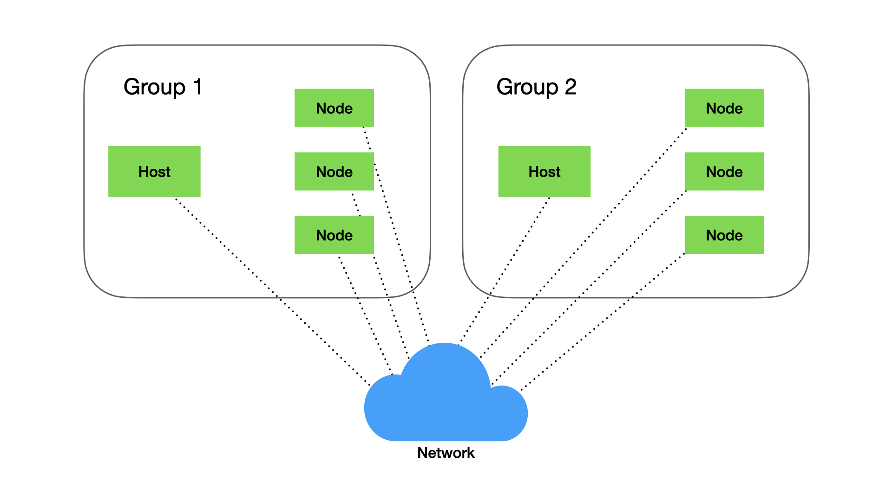
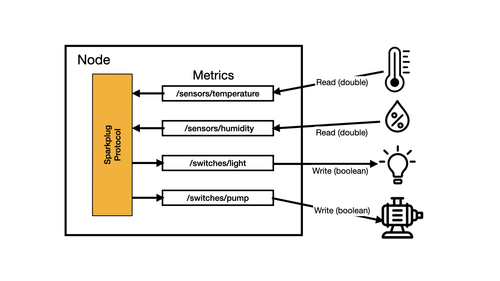

# IoT Sparkplug Module

The Iot Sparkplug Module is a set of Kotlin frameworks that provide an abstraction and an API for simplifying access to the  Sparkplug protocol, both from a Host application, or from EoN Nodes.

## A Quick Sparkplug Primer

This section provides a quick introduction to the Sparkplug protocol - for a complete description refer to the Sparkplug Specification [Sparkplug Specification](https://sparkplug.eclipse.org/specification/version/3.0/documents/sparkplug-specification-3.0.0.pdf)

### Hosts, Nodes and Groups

A Sparkplug system will contain a Master Host Application and a set of EoN Nodes. The master host application is identified by a **host-application-id,** and each node is identified by a unique **node-id**.

These are bound together as a ***group*** which is identified  by a group id. The Master Host Application will only see messages from nodes within the same group , and similarly the host application will only see messages from nodes in the same group. In Greenglass the groupId is a configurable value that can be applied to a host and a set of nodes.

This allows multiple Sparkplug systems to coexist on the same physical network.



### Nodes and Metrics

 The sensor readings and commands used by the Sparkplug system are called **Metrics**.

A metric has:

- A **name**, with a path-like structure  e.g. '/sensors/temperature'
- A **type** e.g boolean, double, int8, int16, int32 - etc (refer to the sparkpliug specification for the full list)
- A **direction**, whether the metric is readable, writeable or both

Each node implements one or more metrics which correspond with the sensors and controlled  device that the node is responsible for.




**This means that each physical sensor or controlled device is identifiable by a node-id and a metric-name**

### Sparkplug Messages

Sparkplug messages are MQ/TT  messages defined by a Sparkplug-specific topic and containing a Sparkplug  specific payload.

The topic has th following standard form:

```
namespace/group_id/message_type/edge_node_id/[device_id]
```

Where

- **namespace** is always "spBv1.0" which defines Sparkplug B, version 1.0
- **group_id** is as described above
- **message_type** - see next section
- edge_node_id - is the node-id as described above
- **device-id**  - this is currently not used in Greenglass

The message_types are:

- **NBIRTH** – Birth certificate for Sparkplug Edge Nodes
-  **NDEATH** – Death certificate for Sparkplug Edge Nodes 
- DBIRTH – Birth certificate for Devices (not used)
-  **DDEATH** – Death certificate for Devices (not used)
-  **NDATA** – Edge Node data message
-  **DDATA** – Device data message
-  **NCMD** – Edge Node command message
-  **DCMD** – Device command message (not used)
-  **STATE** – Sparkplug Host Application state message

### Sparkplug Data Payloads

For full details of the Sparkplug data payload see the  [Sparjplug Protocol Definition](https://sparkplug.eclipse.org/specification/version/3.0/documents/sparkplug-specification-3.0.0.pdf)

Data payloads are used in NBIRTH, DBIRTH, NDATA, DDATA, NCMD and DCMD messages. The payload structure is essentially a simple list of metric definitions and their values

### Session Concept

The Sparkplug protocol uses a session concept based around the "last-will-and-testament" feature of MQ/TT. 

> This feature allows an MQ/TT client to provide a message to the broker (called the "will") when it connects, which will be published by the broker in the event that it looses connection with the client.

The Sparkplug protocol uses two messages NBIRTH and NDEATH to 'open' and 'close' a node session which is identified by a sequence number called "birth-death sequence number " (bdSeq).

- The node attempts to connect to the broker and the connection request contains an NDEATH message with a bdSeq value of the next session.
- If successful the node publishes an NBIRTH message containing all its Metric values (read and write) and using the bdSeq of the new session. When the Host Application receives this message it knows that the node is alive and the current values of all its metrics.
- If the MQ/TT keep-alive for the node fails, the broker will publish that node's NDEATH message. On receiving this the Host Application will know that the node is not active, and any metric values it has for the node are no longer valid.

### Report-by-exception

Because the Host Application can reliably know  the state of a node and therefore whether the metric values are up-to-date, there is no need to poll a node for metric values. Rather the node can use a "report-by-exception" mechanism whereby it sends only changed values.  This means that the network traffic in a Sparkplug system is typically quite low, and the host application can be asynchronous, simply responding to changes as they happen, making it very efficient.

### Host State

The Host Application uses a similar mechanism to report it state to the nodes in its group, using the STATE message. All nodes in the group can listen for this message to know whether their controlling host application is online or offline.

The topic of this message has the form:

```
spBv1.0/STATE/[host_application_id]
```

identifing the host-application-id.

The payload of this message is a simple json envelope containing the state of the host application - ONLINE or OFFLINE.

- When the host application connects to MQ/TT broker it provides an OFFLINE STATE message as its will.
- Once connected it broadcase an ONLINE STATE message. This is broadcast with a retain = true which means the broker will return it whenever a node subscribes to this STATE topic, so the nodes will always know the state of their host application.

### Commands and Data

Command (NCMD) messages are issued only by the (primary) Host Application, and are used to write values to metrics in a specific node.

Data (NDATA) messages are issued only by nodes, in two circumstances:

1. On receipt of an NCMD the node will write the metric then publish an NDATA for this metric containing the  new value.
2. When a readable metric value has changed the node will publish an NDATA containing the new value.

Non-primary applications can simply listen for NDATA messages to get a complete picture of all metric values within the system.

## The Greenglass Sparkplug Implementations

The Greengrass Iot-Sparklug module provides implementations of the Sparkplug protocol for use in Host applications and Nodes. Each implementation provides a service with a simple API.

These implementations are based arount the Eclipes Tahu Java implementation of the Sparkplug protocol, full details of which can be found [here](https://github.com/eclipse/tahu).

**Greenglass currently implements a limited subset of the features available in the Sparkplug metric definitions, in particular it does not implement Metadata**, and it does not support the full set of Metric Datatypes. THESE FEATURES CAN BE ADDED IF REQUIRED.

### Bridge Datatypes

Rather than using the Tahu Metric class throughout a Greenglass application, the IoT-Sparkplug provides its own MetricValue class containing a very simple subset of the Metric class' fields.

#### MetricValue

The MetricValue class is a subset of a Tahu Metric class, which provides the reduced set of fields used by Greenglass. 

These are essentially the

- type
- value
- timestamp

fields from the Metric class

```kotlin
open class MetricValue() {
    var type = MetricDataType.Unknown
		var value: Any? = null
    var timestamp: Date = Date()
}
```

The Metric Value class provides a wide range of constructors and helper functions to simplify the use of this class.

Constructors


Host 